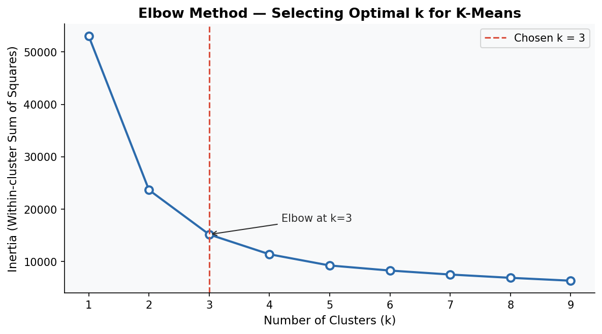

# School Attendance Risk Analysis
**Connecticut K-12 Attendance Data | Python · pandas · scikit-learn**

---

## Overview

Chronic absenteeism is one of the strongest early-warning signals for academic failure and dropout risk. This project analyzes three years of Connecticut public school attendance data (2019–2022) to identify which student groups and districts are most at risk — covering the pandemic disruption and its lingering effects.

Using data preprocessing and K-Means clustering, the analysis categorizes each district–student group combination into **Low**, **Medium**, or **High** attendance risk, providing a data-driven foundation for targeted intervention.

---

## Key Findings

- **Statewide attendance has declined every year since the pandemic.** Connecticut's overall attendance rate fell from **94.8% in 2019-2020** to **92.9% in 2020-2021**, and further to **91.7% in 2021-2022** — a 3+ point drop over three years with no sign of full recovery.

- **Students experiencing homelessness are the highest-risk group.** Their statewide attendance rate of **83.5% in 2021-2022** is more than 8 points below the state average, and their attendance actually worsened during COVID (88.8% → 81.6%) before partially recovering.

- **8.6% of district-group records fall in the High Risk cluster**, with New Haven, Hartford, and New Britain school districts appearing most frequently among high-risk records.

- **K-Means clustering (k=3) cleanly separates three distinct risk tiers**, validated by the elbow method. The clusters map intuitively to attendance bands: High Risk (~85–88%), Medium Risk (~90–92%), and Low Risk (~93–96%).

- **Racial and socioeconomic gaps persist across all three years.** Black and Hispanic/Latino students consistently attend at rates 3–5 points lower than White students, mirroring national patterns.

---

## Charts

### Elbow Method — Validating k=3


### Statewide Attendance Trends by Student Group (2019–2022)


### Risk Cluster Distribution


### Cluster Profile Heatmap


---

## Project Structure

```
attendance-risk-analysis/
│
├── data/
│   └── School_Attendance_dataset.csv   # Source data (CT Open Data)
│
├── figures/
│   ├── elbow_chart.png                 # k selection justification
│   ├── attendance_trends.png           # Year-over-year trends by group
│   ├── risk_distribution.png           # Cluster size breakdown
│   └── cluster_heatmap.png             # Mean attendance per cluster
│
├── output/
│   └── cleaned_attendance_data.csv     # Processed dataset with risk labels
│
├── scripts/
│   ├── data_preparation.py             # Cleaning, normalization, clustering
│   └── visualize.py                    # All chart generation
│
├── requirements.txt
└── README.md
```

---

## How to Interpret the Results

The cleaned output (`output/cleaned_attendance_data.csv`) adds two columns to each record:

- **`attendance_cluster`** — the raw cluster number assigned by K-Means (0, 1, or 2)
- **`risk_label`** — a human-readable label derived by ranking cluster centers from lowest to highest mean attendance

| Risk Label | What It Means | Typical Attendance Range |
|---|---|---|
| **Low Risk** | Attendance is consistently strong across all three years | 93–97% |
| **Medium Risk** | Attendance is below average but not critically low; may show decline | 90–93% |
| **High Risk** | Attendance is significantly below average, or dropped sharply during COVID and has not recovered | Below 88% |

A record flagged as **High Risk** does not mean an entire school district is failing — it means that *for that specific student group in that district*, attendance patterns warrant closer attention. A single district may have Low Risk records for most groups and High Risk records for one or two vulnerable groups (e.g. students experiencing homelessness), which is itself an actionable insight.

For a full narrative of what the data reveals, see [findings.md](findings.md).

---

## Methodology

### Data Source
Connecticut State Department of Education — School Attendance dataset, covering 201 school districts across 13 student group categories for school years 2019-2020, 2020-2021, and 2021-2022.

### Data Preparation
1. **Column standardization** — names lowercased and normalized to snake_case
2. **Missing value handling** — categorical nulls filled with `"Unknown"`; numeric nulls filled with column median (chosen over `0` to avoid distorting the scale)
3. **Date parsing** — `date_update` converted to `datetime`
4. **Min-Max normalization** — all numeric columns scaled to [0, 1] for clustering

### Clustering
- **Algorithm:** K-Means (scikit-learn), `random_state=42`, `n_init=10`
- **Features:** attendance rates across all three school years
- **k=3** selected via the elbow method (see chart above)
- **Risk labels** assigned by sorting cluster centers: lowest mean attendance → High Risk, highest → Low Risk (deterministic, not arbitrary)

---

## How to Run

```bash
# 1. Clone the repo
git clone https://github.com/cebrucean/school-attendance-risk-analysis
cd school-attendance-risk-analysis

# 2. Install dependencies
pip install -r requirements.txt

# 3. Run data preparation
python scripts/data_preparation.py

# 4. Generate visualizations
python scripts/visualize.py
```

Figures will be saved to `figures/` and the cleaned dataset to `output/`.

---

## Technologies

| Tool | Purpose |
|---|---|
| Python 3 | Core language |
| pandas | Data loading, cleaning, transformation |
| scikit-learn | MinMaxScaler, KMeans clustering |
| matplotlib | All visualizations |
| pathlib | Cross-platform file paths |

---

## Data Source

Connecticut State Department of Education — [School Attendance Data (CT Open Data Portal)](https://data.ct.gov/)
