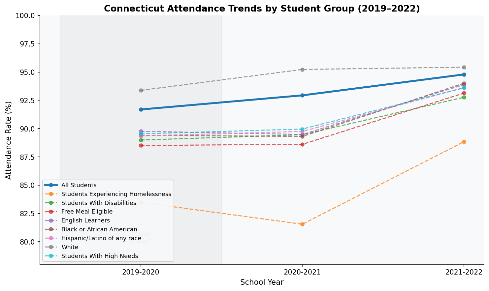
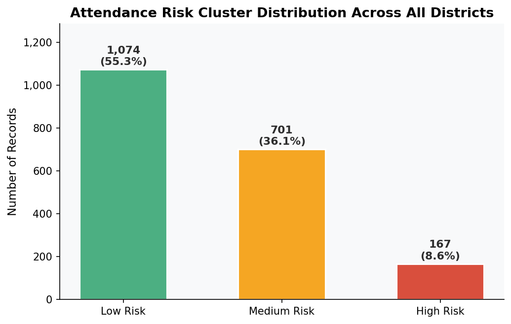
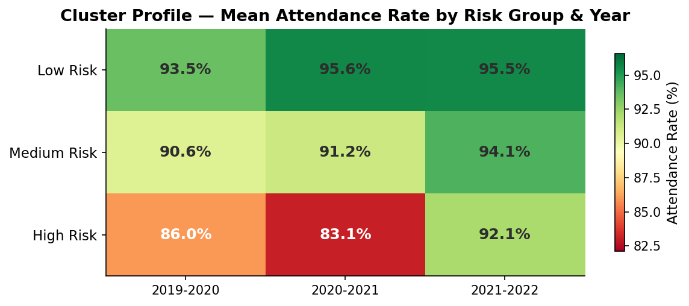

# Findings Report — School Attendance Risk Analysis

**Connecticut K-12 Attendance Data | School Years 2019–2022**

---

## Introduction

This report summarizes the key findings from the Connecticut School Attendance Risk Analysis. The dataset covers 201 school districts and 13 student group categories across three school years, providing a clear window into how attendance patterns shifted before, during, and after the COVID-19 pandemic.

The analysis uses K-Means clustering to group district–student group combinations into three risk tiers: **Low Risk**, **Medium Risk**, and **High Risk**, based on attendance rates across all three years.

---

## Finding 1 — Statewide Attendance Has Declined Every Year Since the Pandemic

Connecticut's overall attendance rate has dropped continuously since 2019-2020, with no sign of full recovery.

| School Year | Statewide Attendance Rate |
|---|---|
| 2019–2020 | 94.8% |
| 2020–2021 | 92.9% |
| 2021–2022 | 91.7% |

That is a **3.1 percentage point decline** over three years. While part of the 2019–2020 drop reflects mid-year school closures, the continued decline into 2021–2022 — a full school year after reopening — indicates that pandemic-era disengagement has persisted well beyond the initial disruption.

---

## Finding 2 — Students Experiencing Homelessness Are the Highest-Risk Group

Among all student groups tracked statewide, students experiencing homelessness show the lowest attendance and the most volatile trend.

| School Year | Attendance Rate |
|---|---|
| 2019–2020 | 88.8% |
| 2020–2021 | 81.6% |
| 2021–2022 | 83.5% |

Their attendance fell nearly **7 points during COVID** — far steeper than any other group — and has only partially recovered. Even in 2021–2022 they remain more than **8 points below the state average**, the largest gap of any student group. This group represents the clearest case for prioritized district-level intervention.

---

## Finding 3 — Structural Inequities Are Visible Across All Three Years

Attendance gaps between student groups are not a pandemic artifact — they existed before COVID and have widened since. The table below shows 2021–2022 statewide attendance rates by group:

| Student Group | 2021–2022 Rate | Gap vs. State Avg |
|---|---|---|
| Students Without High Needs | 94.0% | +2.3 pts |
| White | 93.4% | +1.7 pts |
| All other races | 93.1% | +1.4 pts |
| **State Average** | **91.7%** | — |
| English Learners | 89.8% | −1.9 pts |
| Students With High Needs | 89.5% | −2.2 pts |
| Black or African American | 89.4% | −2.3 pts |
| Hispanic/Latino of any race | 89.4% | −2.3 pts |
| Free/Reduced Price Meal Eligible | 89.0% | −2.7 pts |
| Students With Disabilities | 89.0% | −2.7 pts |
| Students Experiencing Homelessness | 83.5% | −8.2 pts |

A consistent 3–5 point gap between White students and Black and Hispanic/Latino students has persisted across all three years, suggesting systemic factors rather than pandemic-specific causes.

---

## Finding 4 — Recovery Is Unequal Across Groups

Between 2020–2021 and 2021–2022, different student groups recovered at very different rates. Notably, **students who were already struggling recovered slightly, while higher-performing groups declined further.**

| Student Group | Change (2020–21 → 2021–22) |
|---|---|
| Students Experiencing Homelessness | **+1.93 pts** ↑ |
| English Learners | **+0.28 pts** ↑ |
| Black or African American | **+0.10 pts** ↑ |
| Free Meal Eligible | −0.10 pts |
| Students With High Needs | −0.42 pts |
| All Students | −1.25 pts |
| White | −1.85 pts |
| Students Without High Needs | **−2.18 pts** ↓ |

This pattern suggests that interventions targeting high-need groups may have had some effect — but that attendance problems have now spread into groups that were previously stable, broadening the overall risk landscape.

---

## Finding 5 — The Clustering Reveals a Clear Geographic Dimension

The K-Means model identified three well-separated attendance risk tiers:

| Risk Label | Mean Attendance (2021–22) | Mean Attendance (2020–21) | Record Count |
|---|---|---|---|
| Low Risk | 93.5% | 95.6% | 1,074 |
| Medium Risk | 90.6% | 91.2% | 701 |
| High Risk | 86.0% | 83.1% | 167 |

High-risk records are concentrated in a small number of districts. The five districts appearing most frequently in the High Risk cluster are:

1. Area Cooperative Educational Services
2. New Haven School District
3. Hartford School District
4. Ledyard School District
5. New Britain School District

Meanwhile, the highest-attending districts in 2021–2022 — Wilton, Madison, and New Canaan — all sit above 95.6%, a nearly **10-point gap** from the lowest-performing districts. That spread points to district-level resource and policy differences as a major driver of attendance outcomes.

---

## Summary

| Insight | Implication |
|---|---|
| Statewide attendance has fallen 3+ points since 2019 | Post-pandemic disengagement is a systemic issue, not a blip |
| Homelessness is the strongest predictor of attendance risk | Housing-stable intervention programs may yield outsized returns |
| Racial and socioeconomic gaps predate COVID and persist | Structural, not situational — requires long-term policy focus |
| Higher-performing groups are now declining faster | Risk is broadening beyond traditionally at-risk populations |
| 10-point gap between best and worst districts | District-level leadership and resources are a key lever |

---

*Analysis performed using Python (pandas, scikit-learn, matplotlib). Full methodology and code available in the project README.*
